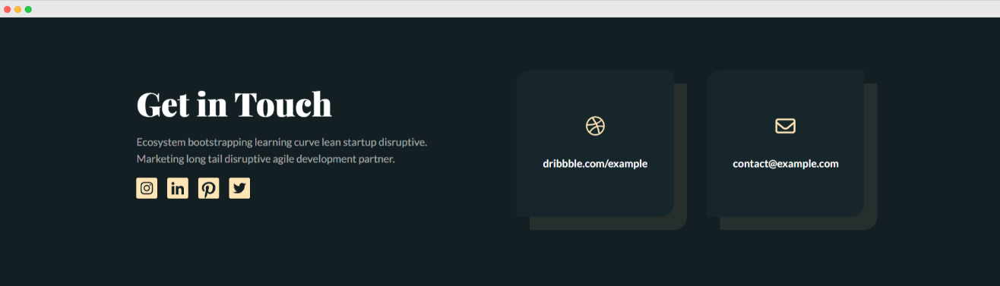

### Opdracht: Bouw een Footer op Basis van een Gegeven Afbeelding

#### Doel:
Het doel van deze opdracht is om een footer te bouwen die gebaseerd is op een gegeven afbeelding. Je zult gebruik maken van HTML en CSS om de footer zo nauwkeurig mogelijk na te bouwen, waarbij je let op kleurgebruik, spacings en nadenken over een ontwerp dat geschikt is voor mobiele apparaten.

#### Vereisten:
1. **Gegeven Afbeelding**: Gebruik de gegeven afbeelding als referentie voor het ontwerp van de footer. Zorg ervoor dat je de structuur, kleuren en layout van de afbeelding nauwkeurig volgt.

2. **HTML-structuur**: Gebruik semantische HTML-elementen om de footer op te bouwen. Denk aan `<footer>`, `<ul>`, `<li>`, en `<a>` tags om de juiste structuur te creëren.

3. **CSS-styling**: Gebruik CSS om de footer vorm te geven en te stylen op basis van de gegeven afbeelding. Let op de kleuren, afmetingen, lettertypen en spacings om het ontwerp zo nauwkeurig mogelijk na te bootsen.

4. **Responsiviteit**: Zorg ervoor dat de footer goed wordt weergegeven op verschillende schermformaten, inclusief mobiele apparaten. Denk aan het aanpassen van de layout, het verbergen of tonen van elementen en het gebruik van media queries om de footer geschikt te maken voor mobiele weergave.

#### Extra Uitdagingen:
- Voeg interactieve elementen toe aan de footer, zoals hover-effecten voor links.
- Experimenteer met CSS Grid of Flexbox om de layout van de footer te verbeteren.
- Zorg voor een soepele overgang tussen desktop- en mobiele weergave door gebruik te maken van vloeiende overgangen en animaties.
